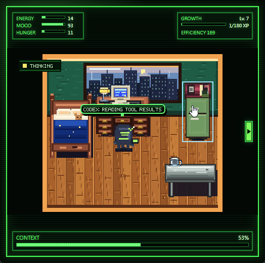
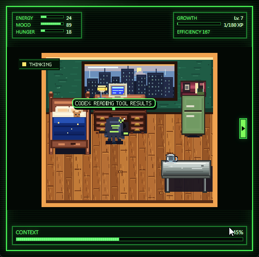
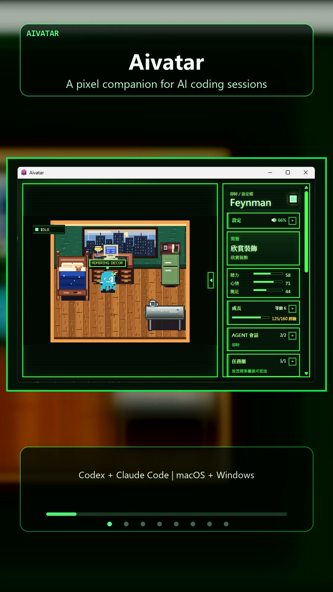
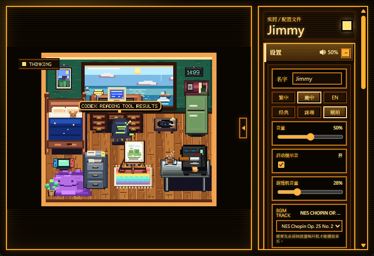
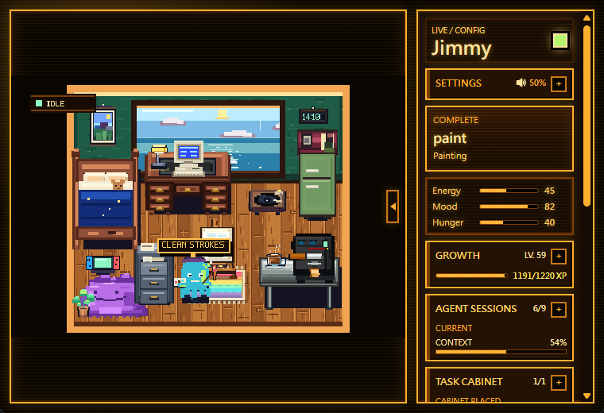
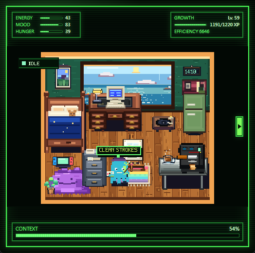
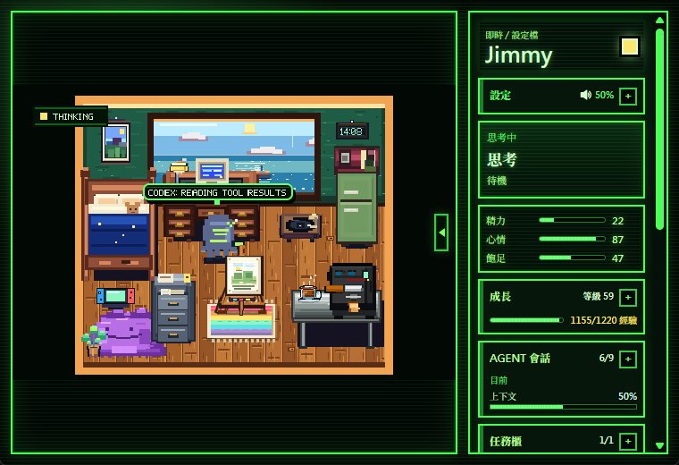

# Aivatar


**EN** | Aivatar is a local-first desktop companion for AI coding agents. It turns Codex, Claude Code, or another agent session into a small pixel-room avatar that reacts to live status, earns `bits`, grows from completed work, and lets you decorate a personal workspace.

**中文** | Aivatar 是一个本地优先的 AI 编程智能体桌面伙伴。它把 Codex、Claude Code 或其他 agent 的会话状态映射成像素房间里的小伙伴行为：思考、编码、等待、报错、完成任务，并通过 `bits`、成长、背包、商店和房间装修形成一个可互动的工作陪伴系统。

<p align="center">
  <a href="https://github.com/ruiwuniu/Aivatar-Demo/releases/download/v0.1.1-desktop-preview/Aivatar_0.1.0_universal.dmg"><strong>Download macOS DMG</strong></a>
  ·
  <a href="https://github.com/ruiwuniu/Aivatar-Demo/releases/download/v0.1.1-desktop-preview/Aivatar_0.1.0_x64-setup.exe"><strong>Download Windows EXE</strong></a>
  ·
  <a href="https://github.com/ruiwuniu/Aivatar-Demo/releases/tag/v0.1.1-desktop-preview">Preview Release</a>
</p>

| Live AI session companion | Growth and session summaries |
| --- | --- |
|  |  |

<p align="center">
  <a href="docs/assets/aivatar-30s-vertical-promo.mp4">
    
  </a>
</p>

<p align="center">
  <a href="docs/assets/aivatar-30s-vertical-promo.mp4"><strong>Watch the 30-second vertical demo video</strong></a>
</p>

> Current status / 当前状态: preview builds are available for macOS and Windows. These builds are unsigned and intended for GitHub-only tester distribution while installer and release-mode integrations continue to harden.

## Contents / 目录

- [User Manual / 用户手册](#user-manual--用户手册)
- [UI Showcase / UI 展示](#ui-showcase--ui-展示)
- [Developer Manual / 开发者手册](#developer-manual--开发者手册)
- [Agent Status Protocol / Agent 状态协议](#agent-status-protocol--agent-状态协议)
- [Content Configuration / 内容配置](#content-configuration--内容配置)
- [Privacy And Local Data / 隐私与本地数据](#privacy-and-local-data--隐私与本地数据)
- [Roadmap Notes / 路线图说明](#roadmap-notes--路线图说明)

## User Manual / 用户手册

### What Aivatar Does / Aivatar 能做什么

**EN**

- Shows a cozy pixel room with bedroom, office, kitchen, furniture, windows, wallpaper, floor styles, and placed items.
- Animates an avatar across behavior states such as idle, exploring, sleeping, interacting, thinking, coding, waiting, error, and success.
- Follows live local agent sessions through a WebSocket bridge.
- Tracks multiple sessions by `agent + sessionId`, including current, followed, connected, stale, and idle sessions.
- Rewards eligible completed Codex or Claude Code sessions with `bits` based on reported token usage.
- Lets you spend `bits` on consumables, decor, furniture skins, windows, wall surfaces, floor surfaces, and room items.
- Provides local save slots, avatar naming, JSON/folder save import, and local state persistence.
- Includes a Task Cabinet for launching one-off or scheduled markdown prompt tasks through the selected CLI agent.
- Provides a CLI Launcher for starting connected Codex or Claude Code sessions from the desktop app.
- Includes an Asset Studio entry point, but it is currently marked as in development.

**中文**

- 展示一个像素风房间，包含卧室、办公区、厨房、家具、窗户、墙纸、地板和可摆放物品。
- 让小伙伴根据状态执行不同动作，例如闲置、探索、睡觉、互动、思考、编码、等待用户、报错和成功。
- 通过本地 WebSocket 桥接实时跟随 agent 会话。
- 按 `agent + sessionId` 跟踪多会话，区分当前、跟随中、已连接、过期和闲置状态。
- 对符合条件的 Codex 或 Claude Code 完成会话，根据上报 token 用量奖励 `bits`。
- 用 `bits` 购买消耗品、装饰、家具皮肤、窗户、墙面、地板和房间物品。
- 支持本地存档槽、角色命名、JSON/文件夹存档导入和本地状态持久化。
- 提供任务柜，可以把 Markdown prompt 作为一次性或定时任务交给 CLI agent 执行。
- 提供 CLI 启动器，可从桌面应用中启动已连接的 Codex 或 Claude Code 会话。
- 包含素材工坊入口，但当前仍标记为开发中，不应视为完整功能。

### Basic Use / 基本使用

**EN**

1. Launch Aivatar.
2. Choose an existing local save slot, create a new character room, or import an Aivatar save JSON/folder.
3. Use the room directly even without Codex or Claude Code installed.
4. Interact with furniture and placed items in the canvas.
5. Open Inventory, Shop, and Decor panels to use items, buy supplies, apply furniture skins, change wall/floor surfaces, and move windows or furniture.
6. Open Agent Sessions to inspect live sessions, follow a session, disconnect one, or clear stale sessions.
7. Use the debug/status tools only when testing behavior or developing integrations.

**中文**

1. 启动 Aivatar。
2. 选择已有本地存档，创建新的角色房间，或导入 Aivatar 存档 JSON/文件夹。
3. 即使没有安装 Codex 或 Claude Code，也可以独立使用房间、背包、商店、装修和存档功能。
4. 在画布中点击家具或摆放物品进行互动。
5. 打开背包、商店和装修面板，使用物品、购买道具、应用家具皮肤、更换墙面/地板，以及移动窗户或家具。
6. 打开 Agent 会话面板查看实时会话、跟随会话、断开会话或清理过期会话。
7. 调试状态工具主要用于测试行为和开发集成，普通使用时不必开启。

### UI Showcase / UI 展示

**EN** | These screenshots show the actual app UI: the pixel room, live agent state, local settings, avatar stats, growth, Agent Sessions, and Task Cabinet panels.

**中文** | 以下截图展示真实应用界面：像素房间、实时 agent 状态、本地设置、角色状态、成长、Agent 会话和任务柜面板。

| Main room and settings / 主房间与设置 | Live status panels / 实时状态面板 |
| --- | --- |
|  |  |

| Compact HUD view / 精简 HUD 展示 | Chinese localized bridge view / 中文本地化桥接展示 |
| --- | --- |
|  |  |

### Agent Integration / Agent 集成使用

**EN**

Aivatar works without an agent, but live companion behavior needs a local status source.

- For a desktop build, the Tauri app can start the local bridge.
- For web preview or development, run `npm.cmd run status:bridge`.
- Codex Desktop can connect through the bundled Aivatar session connector.
- Codex CLI and Claude Code CLI can be launched through wrapper scripts when Node.js and the selected CLI are available on `PATH`.

Connect the current Codex Desktop session:

```powershell
npm.cmd run aivatar:session:setup
npm.cmd run aivatar:connect
```

Disconnect it:

```powershell
npm.cmd run aivatar:disconnect
```

**中文**

Aivatar 不依赖 agent 也能运行，但实时陪伴行为需要一个本地状态来源。

- 桌面版可以由 Tauri 应用启动本地桥接。
- Web 预览或开发时，可以运行 `npm.cmd run status:bridge`。
- Codex Desktop 可通过仓库内置的 Aivatar session connector 连接。
- 当 Node.js 和对应 CLI 已在 `PATH` 中时，Codex CLI 与 Claude Code CLI 可通过包装脚本启动并被 Aivatar 跟随。

连接当前 Codex Desktop 会话：

```powershell
npm.cmd run aivatar:session:setup
npm.cmd run aivatar:connect
```

断开连接：

```powershell
npm.cmd run aivatar:disconnect
```

More details / 更多细节: [docs/aivatar-session-plugin.md](docs/aivatar-session-plugin.md)

### Task Cabinet / 任务柜

**EN**

Task Cabinet lets you register Markdown prompt files and dispatch them through the selected CLI Launcher configuration.

- Only `.md` task paths are accepted.
- Each prompt should stay at or below 24,000 characters.
- Aivatar reads the Markdown file once, creates a temporary prompt copy, and does not write back to the source file.
- Tasks can be run once, rerun, or scheduled.
- Schedule conditions include always, only when idle, and after the previous success.
- A File Cabinet item is part of the in-room dispatch fantasy and can be placed as furniture.

**中文**

任务柜用于登记 Markdown prompt 文件，并通过当前 CLI 启动器配置派发给 agent。

- 只接受 `.md` 任务路径。
- 每个 prompt 建议不超过 24,000 字符。
- Aivatar 只读取 Markdown 文件一次，生成临时 prompt 副本，不会写回源文件。
- 任务可以一次性执行、重新执行或设置排程。
- 排程条件包括永远执行、仅闲置时执行、上次成功后执行。
- File Cabinet 文件柜既是房间家具，也是任务派发的视觉入口。

### Rewards, Growth, And Room Economy / 奖励、成长与房间经济

**EN**

- Completed supported sessions can grant `bits`.
- `bits` can be spent on supplies, decor, surfaces, windows, and furniture skins.
- Consumables affect avatar stats such as energy, mood, and hunger.
- Aivatar records recent local memory events, growth level, XP, milestones, and trait changes.
- Session learning is ignored when marked high privacy risk.

**中文**

- 受支持的完成会话可以奖励 `bits`。
- `bits` 可用于购买道具、装饰、墙面/地板、窗户和家具皮肤。
- 消耗品会影响小伙伴的能量、心情、饥饿等状态。
- Aivatar 会在本地记录近期事件、成长等级、XP、里程碑和特质变化。
- 如果 session learning 结果标记为高隐私风险，应用会忽略该学习结果。

## Developer Manual / 开发者手册

### Tech Stack / 技术栈

**EN**

- Frontend: React 18, TypeScript, Vite.
- Desktop shell: Tauri 2.
- Native bridge and desktop commands: Rust under `src-tauri`.
- Local agent helpers: Node.js scripts under `scripts` and `plugins/aivatar-session-bridge`.
- Runtime content: JSON config under `public/config/aivatar.config.json`, with TypeScript defaults in `src/data/defaultContent.ts`.

**中文**

- 前端：React 18、TypeScript、Vite。
- 桌面壳：Tauri 2。
- 原生桥接和桌面命令：`src-tauri` 下的 Rust 代码。
- 本地 agent 辅助脚本：`scripts` 和 `plugins/aivatar-session-bridge` 下的 Node.js 脚本。
- 运行时内容：`public/config/aivatar.config.json`，并由 `src/data/defaultContent.ts` 提供 TypeScript 默认值。

### Project Layout / 项目结构

```text
.
├─ src/
│  ├─ App.tsx                         # Main React UI and app state
│  ├─ i18n.ts                         # zh-HK, zh-CN, and English UI text
│  ├─ types.ts                        # Shared app data and protocol types
│  ├─ data/
│  │  ├─ defaultContent.ts             # Built-in room, item, shop, and avatar defaults
│  │  └─ loadContent.ts                # Runtime content loading
│  ├─ game/
│  │  ├─ interactions.ts               # Placement, hit testing, and room interaction rules
│  │  ├─ renderScene.ts                # Pixel canvas rendering
│  │  └─ simulation.ts                 # Avatar simulation and behavior transitions
│  └─ hooks/useCodexStatus.ts          # Bridge connection and status snapshot hook
├─ src-tauri/                          # Tauri app, Rust bridge, local commands
├─ scripts/                            # CLI wrappers, bridge, status sender, learning worker
├─ plugins/aivatar-session-bridge/      # Bundled Codex Desktop session connector
├─ public/config/aivatar.config.json    # Runtime content configuration
├─ public/assets/art/                   # Pixel-art asset provenance and sheets
├─ public/audio/                        # Audio assets and attribution notes
└─ docs/                                # Release and integration docs
```

### Setup / 环境准备

**EN**

Install dependencies:

```powershell
npm.cmd install
```

Use `npm.cmd` on Windows if PowerShell blocks `npm.ps1`.

Run the web UI:

```powershell
npm.cmd run dev
```

Run as a desktop app:

```powershell
npm.cmd run tauri dev
```

Build:

```powershell
npm.cmd run build
```

**中文**

安装依赖：

```powershell
npm.cmd install
```

如果 Windows PowerShell 阻止 `npm.ps1`，请使用 `npm.cmd`。

运行 Web UI：

```powershell
npm.cmd run dev
```

以桌面应用运行：

```powershell
npm.cmd run tauri dev
```

构建：

```powershell
npm.cmd run build
```

### Useful Scripts / 常用脚本

| Script | Purpose | 用途 |
| --- | --- | --- |
| `npm.cmd run dev` | Start Vite web dev server | 启动 Vite Web 开发服务器 |
| `npm.cmd run tauri dev` | Start Tauri desktop dev app | 启动 Tauri 桌面开发应用 |
| `npm.cmd run build` | Type-check and build web assets | 类型检查并构建前端资源 |
| `npm.cmd run status:bridge` | Start local status bridge | 启动本地状态桥接 |
| `npm.cmd run status:mock` | Start mock status source | 启动模拟状态源 |
| `npm.cmd run status:send` | Send one status message | 发送单条状态消息 |
| `npm.cmd run aivatar:run -- <cmd>` | Wrap a command lifecycle | 包装一个命令生命周期 |
| `npm.cmd run codex:run` | Start Codex through wrapper | 通过包装器启动 Codex |
| `npm.cmd run claude:run` | Start Claude Code through wrapper | 通过包装器启动 Claude Code |
| `npm.cmd run codex:connected` | Start connected Codex runner | 启动已连接的 Codex runner |
| `npm.cmd run claude:connected` | Start connected Claude Code runner | 启动已连接的 Claude Code runner |
| `npm.cmd run aivatar:connect` | Connect current Codex Desktop session | 连接当前 Codex Desktop 会话 |
| `npm.cmd run aivatar:disconnect` | Disconnect current session | 断开当前会话 |

### Manual Status Testing / 手动状态测试

**EN**

Start the bridge:

```powershell
npm.cmd run status:bridge
```

Send status updates:

```powershell
npm.cmd run agent:send -- --agent codex --session codex-demo thinking "Reading project files"
npm.cmd run agent:send -- --agent codex --session codex-demo executing "Applying patch"
npm.cmd run agent:send -- --agent codex --session codex-demo waiting_for_user "Need approval"
npm.cmd run agent:send -- --agent codex --session codex-demo complete "Task finished"
```

Wrap an arbitrary command:

```powershell
npm.cmd run aivatar:run -- npm.cmd run build
npm.cmd run aivatar:run -- codex
npm.cmd run agent:run -- --agent claude-code -- claude
```

**中文**

启动桥接：

```powershell
npm.cmd run status:bridge
```

发送状态更新：

```powershell
npm.cmd run agent:send -- --agent codex --session codex-demo thinking "Reading project files"
npm.cmd run agent:send -- --agent codex --session codex-demo executing "Applying patch"
npm.cmd run agent:send -- --agent codex --session codex-demo waiting_for_user "Need approval"
npm.cmd run agent:send -- --agent codex --session codex-demo complete "Task finished"
```

包装任意命令：

```powershell
npm.cmd run aivatar:run -- npm.cmd run build
npm.cmd run aivatar:run -- codex
npm.cmd run agent:run -- --agent claude-code -- claude
```

## Agent Status Protocol / Agent 状态协议

### Endpoints / 端点

**EN** | Aivatar listens for status snapshots over WebSocket and accepts HTTP status updates through the local bridge.

**中文** | Aivatar 通过 WebSocket 接收状态快照，并通过本地桥接的 HTTP 接口接受状态更新。

```text
WebSocket:
ws://127.0.0.1:38987/agent-status
ws://127.0.0.1:38987/codex-status  legacy compatibility

HTTP:
POST http://127.0.0.1:38988/agent-status
GET  http://127.0.0.1:38988/agent-status
POST http://127.0.0.1:38988/codex-status  legacy compatibility
GET  http://127.0.0.1:38988/codex-status   legacy compatibility
GET  http://127.0.0.1:38988/health
```

### Status Message / 状态消息

```json
{
  "agent": "codex | claude-code | aider | cursor | custom",
  "sessionId": "optional session id",
  "status": "idle | thinking | executing | waiting_for_user | error | complete",
  "phase": "optional short phase name",
  "task": "optional current task summary",
  "summary": "optional short bubble text",
  "detail": "optional longer detail",
  "progress": 0,
  "message": "optional display text",
  "severity": "info | warning | error",
  "timestamp": "ISO-8601"
}
```

### Snapshot Shape / 快照结构

```json
{
  "type": "aivatar.status.snapshot",
  "currentStatus": {},
  "sessions": [],
  "activeSessionKey": "optional active agent:sessionId",
  "connectedSessionKey": "optional connected agent:sessionId",
  "currentSessionKey": "optional current agent:sessionId",
  "timestamp": "ISO-8601"
}
```

**EN** | The bridge keeps the latest status per `agent + sessionId` and broadcasts session snapshots. Old single-status payloads remain supported for compatibility.

**中文** | 桥接会按 `agent + sessionId` 保存最新状态并广播会话快照。旧版单状态消息仍被兼容。

## Content Configuration / 内容配置

**EN**

Aivatar loads runtime content from:

```text
public/config/aivatar.config.json
```

If loading fails, it falls back to `src/data/defaultContent.ts`. The content model includes:

- avatar name and sprite reference
- room theme, zones, furniture, windows, wall surfaces, and floor surfaces
- starter inventory and placed items
- item definitions, item prices, effects, unlock levels, placement rules, and furniture skins
- shop inventory and currency
- starter pet stats and wallet

**中文**

Aivatar 会从以下位置加载运行时内容：

```text
public/config/aivatar.config.json
```

如果加载失败，会回退到 `src/data/defaultContent.ts`。内容模型包括：

- avatar 名字和 sprite 引用
- 房间主题、区域、家具、窗户、墙面和地板
- 初始背包和已摆放物品
- 物品定义、价格、效果、解锁等级、摆放规则和家具皮肤
- 商店库存和货币
- 初始宠物状态和钱包

## Privacy And Local Data / 隐私与本地数据

**EN**

Aivatar is designed around same-machine local integration.

- The bridge listens on `127.0.0.1` by default.
- Local saves are stored on the user's machine.
- Depending on enabled integrations, Aivatar may read local Codex Desktop session metadata, rollout JSONL activity, Claude Code hook/status payloads, selected Markdown task files, and local save data.
- Task Cabinet reads selected Markdown files into temporary prompt copies and does not write back to source files.
- Operational files may be written under the system temp directory, including bridge state, session helper records, avatar state snapshots, task prompt copies, and learning context digests.
- Review local session files, saves, temp files, and logs before sharing them.

Disable session learning:

```powershell
$env:AIVATAR_LEARNING_ENABLED = "0"
```

Security reporting: see [SECURITY.md](SECURITY.md).

**中文**

Aivatar 的集成边界是同一台机器上的本地通信。

- 桥接默认监听 `127.0.0.1`。
- 本地存档保存在用户机器上。
- 根据启用的集成，Aivatar 可能读取本地 Codex Desktop 会话元数据、rollout JSONL 活动、Claude Code hook/status payload、用户选择的 Markdown 任务文件和本地存档数据。
- 任务柜会把选中的 Markdown 文件读取为临时 prompt 副本，不会写回源文件。
- 运行文件可能写入系统临时目录，包括桥接状态、session helper 记录、avatar 状态快照、任务 prompt 副本和 learning context 摘要。
- 分享本地会话文件、存档、临时文件或日志前，应先自行审查。

关闭 session learning：

```powershell
$env:AIVATAR_LEARNING_ENABLED = "0"
```

安全问题报告请见 [SECURITY.md](SECURITY.md)。

## Assets And Attribution / 资源与署名

**EN** | Bundled asset provenance is tracked in [ATTRIBUTIONS.md](ATTRIBUTIONS.md), [public/audio/README.md](public/audio/README.md), and [public/assets/art/README.md](public/assets/art/README.md). The README banner was generated for this repository and saved at `docs/assets/aivatar-readme-hero.png`.

**中文** | 内置资源来源记录在 [ATTRIBUTIONS.md](ATTRIBUTIONS.md)、[public/audio/README.md](public/audio/README.md) 和 [public/assets/art/README.md](public/assets/art/README.md)。README 顶部宣传图是为本仓库生成的，保存于 `docs/assets/aivatar-readme-hero.png`。

## Roadmap Notes / 路线图说明

**EN**

Current release-prep limitations:

- The Windows preview release path is still being hardened.
- Codex Desktop connector and connected CLI runner scripts are bundled as resources, but connected CLI launch still requires Node.js and the requested agent CLI on `PATH`.
- Native bridge support exists for local status, basic Codex Desktop session discovery, rollout watching, token-usage rewards, and local heuristic session learning.
- A fully Rust-native connected runner and provider-backed release-mode learning remain future hardening work.
- macOS and Linux packaging are planned after the Windows preview path is stable.

**中文**

当前发布准备阶段的限制：

- Windows 预览版发布路径仍在加固。
- Codex Desktop connector 和 connected CLI runner 脚本已作为资源打包，但 connected CLI 启动仍需要 Node.js 和目标 agent CLI 位于 `PATH` 中。
- 本地状态、基础 Codex Desktop 会话发现、rollout watching、token 用量奖励、本地启发式 session learning 已有原生桥接预览实现。
- 完全 Rust-native 的 connected runner 和面向发布模式的 provider-backed learning 仍是后续加固工作。
- macOS 和 Linux 打包计划在 Windows 预览路径稳定后推进。

## License / 许可证

See [LICENSE](LICENSE).
